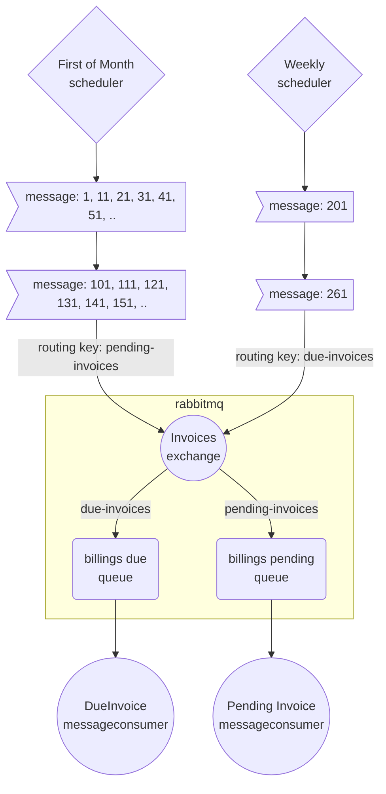
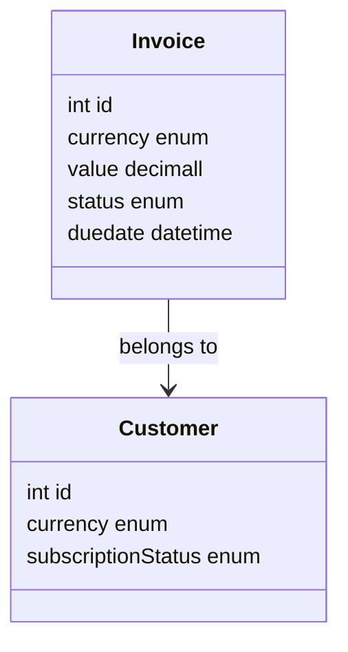

## Proposed solution

For our scheduling purposed I have decided to create a software cron job using kotlin's coroutine feature along with a library to add support for cron expressions.

The idea is to be able to spin up new schedulers easily by adding a generic factory that encapsulate all the logic around how to setup a basic coroutine.

For the proposed scenario I have created two schedulers 

- One is going to wake up every first of the month and will look at all the invoices we have pending from processing payment. 
Because we expect a huge workload everytime we switch months (we are a very successful company after all) we need something that is able to scale and keep up with the 
increasing number of customers we have. Because of that and to avoid long transactions that could lead on failures, I have decided to do this processing offline
using rabbitmq queues. Now with this approach I can decide a batch size I am comfortable with, and split this processing into those batches. 
In the figure below you can see how the sole purpose of the scheduler is to identify those processing batches (list of invoices ids we need to process)
and send a message with that content to a queue.
Later on, a dedicated consumer of that exchange and queue will receive each batch of invoiceIds and try to settle them up.
Because this process is known to possibly fail, we need to add some resiliency to the solution. 
One approach is to identify those transient exceptions that can be retried ->  In this case only NetworkException seems retryable.
I have proposed a RetryPolicy that retry only those exceptions a number of times, with exponential backoff to increase chances of recovery.
For the rest of the possible exceptions I will assume we need some sort of manual intervention and I will just log the exception with the failing id.

- A second scheduler will wake up every sunday, and will try to settle every invoice that has not being able to be paid because of insufficient funds.
Of course, we won't be retrying indefinitely, so a **due date** field has been added to every invoice to mark when the payment should be made.
Its consumer will try to settle one more time, and in case of insufficient funds again, and if the invoice due date is past the grace period (defined arbitrarily to 30 days) we will, regretting it so much, disable the subscription for the customer.

In this figure we can see the extended model with due date and subscription status for a customer.

## Possible Improvements
- Right now we are not able to autoscale based on the traffic in the queues. Because of how everything is set up in a single app, and the fact
that we need to enforce to have a single scheduler running, we wont have multiple instances of the consumers. In order to achieve all the
goodness of having this rabbitmq solution, I'd split this app into multiple apps:
  - the rest api (this can and should have multiple replicas), 
  - the schedulers (enforced to just one replica) can be in one app together or separate them into its own apps.
  - The consumer for monthly billing 
  - The consumer for due invoices

- There isn't any config/settings file, we could add one for things like the scheduler's frequency, which we could change from one environment or another.
- (i.e for development frequency could be every 10 min, for a local setup every 10 seconds,...)
- Test coverage is poor. I haven't add tests for every public function
- docker compose file does not include the app,somehow I have had problems with the dockerfile because some unix characters messing up with my windows environment.
- I could add some more business logic to notify customers when problems with their subscription happens i.e by email.
- Right now I don't handle entityNotFound scenarios or CurrencyMismatch scenarios, apart from log an error.